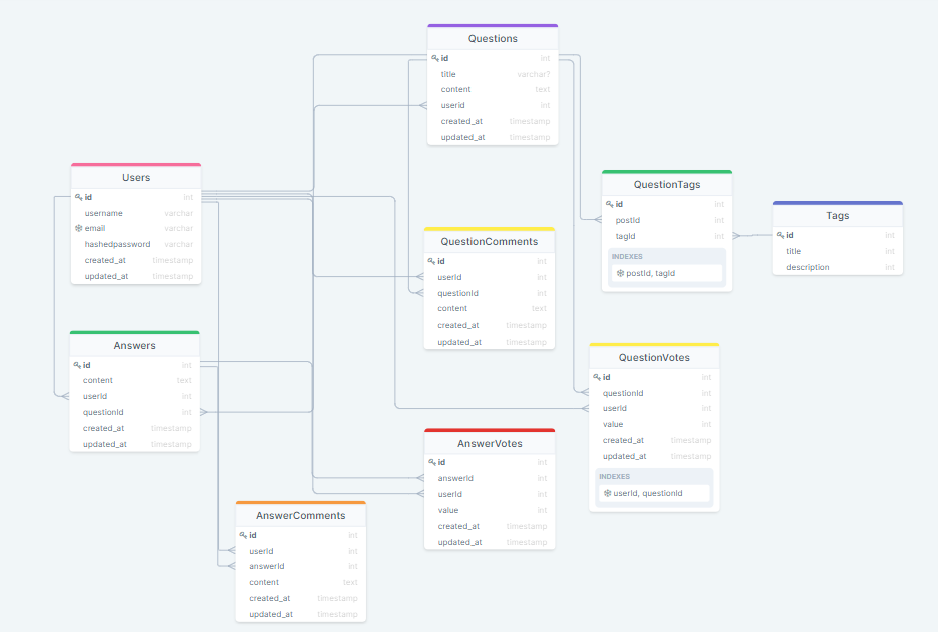

# SlipbopOverflow

## Database Diagram

https://drawsql.app/stackunderflowaa/diagrams/slipbopoverflow

## WireFrames

https://balsamiq.cloud/stq3icg/pewtmv/r2278

## Routes
### Front-End Routes
- GET /
  - When logged in - Similar to /questions
  - When not logged in - Splash page
  
- GET /users
- GET /users/{user-id}
- GET /users/signup
- GET /users/login
- GET /users/logout

- GET /questions/
- GET /questions/{question-id}
  - Will grab associated answers
- GET /questions/ask
- GET /search?q={the-question}

### Back-End Routes
- POST /api/users
- POST /api/users/token
- POST /api/questions
- GET /api/questions/{question-id}/comments
  - question comments - AJAX on /questions/{id} page
- GET /api/questions/{question-id}/answers/{answer-id}/comments
  - answer comments - AJAX on /questions/{id} page
- POST /api/questions/{question-id}/answers
  - answer a question - AJAX on /questions/{id} page
- POST /api/questions/{question-id}/comment
  - post a question comment - AJAX on /questions/{id} page
- POST /api/questions/{question-id}/answers/{answer-id}/comment
  - post an answer comment - AJAX on /questions/{id} page
- POST /api/questions/{question-id}/votes
  - upvote a question (or take away a previous upvote)
- DELETE /api/questions/{question-id}/votes/
  - downvote a question (or take away a previous downvote)
- POST /api/questions/{question-id}/answers/{answer-id}/votes
  - upvote an answer (or take away a previous upvote)
- DELETE /api/questions/{question-id}/answers/{answer-id}/votes
  - downvote an answer (or take away a previous downvote)
- POST /api/search/{sort}

### Stretch

- GET /tags
- GET /questions/tagged/{tag-name}
- PUT /api/users/{userid}/edit
