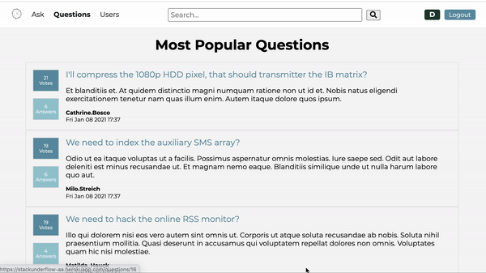
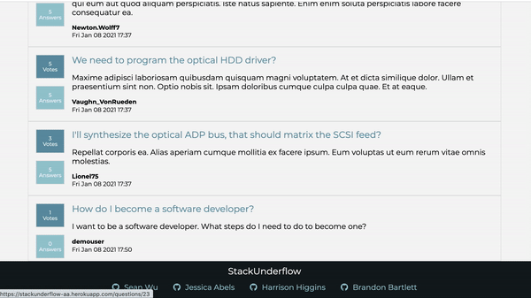
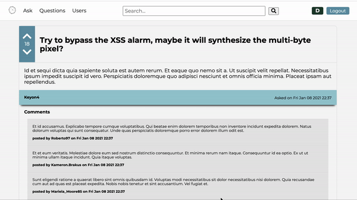

# StackUnderflow

[Live Link](https://stackunderflow-aa.herokuapp.com)

## Summary
This is a clone of the popular site *StackOverflow*. Users are able to login and ask code related questions, answer other user's questions, and comment on both. Both questions and answers are voted on which is used to bring more popular or useful content to the top of term based search results.

Users are also able to track their own contributions using user profile pages, giving quick access to all content (questions, answers, comments) for that user.
## Technologies Used
- JavaScript
- NodeJS
- Express
- Sequelize
- PostgreSQL
- HTML5
- CSS3
- Pug
- Heroku

## Features
### Search

Search returns the most upvoted questions and answers that contain the search term. Below is a snippet that populates the user's homepage with the top one hundred questions. Similar logic is used for search, but includes answers. 

```js
router.post("/homePage", asyncHandler( async(req, res, next) =>{
    const questions = await Question.findAll({
        limit: 100,
        attributes: {
            include:[[
                sequelize.literal(`(SELECT COALESCE(SUM(qv.value), 0)
                                    FROM "QuestionVotes" AS qv
                                    WHERE qv."questionId" = "Question".id)`
                ), "score"
            ]]       
        },
        include: [User, Answer],
        order: [
            [sequelize.literal('score'), 'DESC']
          ],
    });
    res.json(questions)
}));
```
### Answer a Question

### Voting

AJAX voting for real time updates. This snippet shows the associated code.
```js
const getVotes = async () => {
  const res = await fetch(`/api/questions/${questionId}/vote`, {
    method: "GET",
    headers: {
      "Content-Type": "application/json"
    }
  });
  const votes = await res.json();

  if (votes.questionVote) {
    if (votes.questionVote === 1) {
      document.querySelector(".question__upvote").classList.add("on")
    } else if (votes.questionVote === -1) {
      document.querySelector(".question__downvote").classList.add("on")
    }
  }

  votes.answerVotes.forEach(obj => {
    if (obj.value === 1) {
      document.querySelector(`#answer-${obj.answerId} .answer__upvote`).classList.add("on")
    } else {
      document.querySelector(`#answer-${obj.answerId} .answer__downvote`).classList.add("on")
    }
  });
}
```


***
## Useful Links
- [Database Diagram](./documentation/erd.png)
- [Routes](./documentation/routes.md)
- [Feature List](./documentation/feature-list.md)
***

## Potential Future Features
- Rich Text Editor
- Question Tags
- Search result pagination

***
## Dev Instructions

1. Clone this repository:
    ```bash
    git clone https://github.com/seanwu84/StackUnderflow.git
    ```

2. Install dependencies
    ```bash
    npm install
    ```
3. Create a **.env** file based on the example with proper settings for your
   development environment (refer to **.env.example**)
4. Create your database, migrate your database, seed your database, and start your express app
    ```bash
    npx dotenv sequelize db:create
    npx dotenv sequelize db:migrate
    npx dotenv sequelize db:seed:all
    npm start
    ```
5. Navigate to your app running on http://localhost:8080

## Heroku Instructions

1. Setup
    Log into Heroku and create a new dyno
    Download the latest version of StackUnderflow from github

2. Add a Database
    Within the Heroku project, go to the "Resource" tab and add the extension "Heroku Postgres"
    This can be added at the free tier

3. Setup Enviromental Variables
    With the Heroku project, go to "Settings" and "Config Vars"
    Add the following varables:
        JWT_SECRET=[SECRET]
        JWT_EXPIRES_IN=604800   

4. Push to Heroku
    Assuming you have the Heroku CLI installed, run "heroku login" from within the StackUnderflow directory
    Login in the window that is openned
    Run "heroku git:remote -a «your-app-name»"
    Run "git push heroku" and wait for it to finish deployment
    Run "heroku run npx sequelize-cli db:migrate"
    Run "heroku run npx sequelize-cli db:seed:all"

